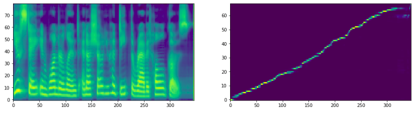
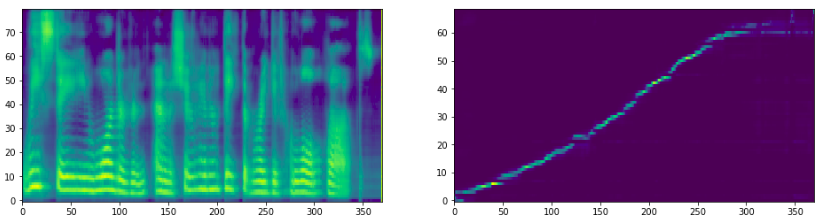

## NOTE
This is a forked version of NVIDIA's tacotron2 repository, which I changed to work on NVIDIA K80 GPUs, instead of the V100 GPUs, used originally by them. 

# Tacotron 2 (using Griffin Lim, not Wavenet)

Tacotron 2 PyTorch implementation of [Natural TTS Synthesis By Conditioning
Wavenet On Mel Spectrogram Predictions](https://arxiv.org/pdf/1712.05884.pdf). 

This implementation includes **distributed** and **fp16** support
and uses the [LJSpeech dataset](https://keithito.com/LJ-Speech-Dataset/).

Distributed and FP16 support relies on work by Christian Sarofeen and NVIDIA's
[Apex Library](https://github.com/nvidia/apex).

Results from Tensorboard while Training:

## Pre-requisites
1. NVIDIA GPU + CUDA cuDNN

## Setup
1. Download and extract the [LJ Speech dataset](https://keithito.com/LJ-Speech-Dataset/)
2. Clone repo: `git clone https://github.com/RiccardoGrin/NVIDIA-tacotron2.git`
3. CD into repo: `cd NVIDIA-tacotron2`
4. Update .wav paths: `sed -i -- 's,DUMMY,/home/ubuntu/LJSpeech-1.1/wavs,g' filelists/*.txt`
    - Alternatively, set `load_mel_from_disk=True` in `hparams.py` and update mel-spectrogram paths 
5. Install [pytorch 0.4](https://github.com/pytorch/pytorch)
6. Install python requirements: `pip install -r requirements.txt`
7. Change 'dist_url' in hparams.py to the repo directory, where test.dpt file does not exist

## Training
1. `python train.py --output_directory=outdir --log_directory=logdir`
2. (OPTIONAL) `tensorboard --logdir=outdir/logdir`

## Multi-GPU (distributed) and FP16 Training
1. `python -m multiproc train.py --output_directory=outdir --log_directory=logdir --hparams=distributed_run=True,fp16_run=True`

This does train much faster and better than the normal training, however this may start by overflowing for a few steps, 
with messages similar to the following, before it starts training correctly:

'OVERFLOW! Skipping step. Attempted loss scale: 4294967296'

## Inference
1. Start and open a Jupyter Notebook
2. Open inference.ipynb
3. Follow instructions on notebook and run

## Inference results
Below are the inference results after 15750, and 4750 steps respectively, for the input text: "You stay in Wonderland and I show you how deep the rabbit hole goes." - Morpheus, The Matrix

You can download 'inference_test_15750.wav' and 'inference_test_4750.wav', to listen to the respective audio generated. Around step 4750, is when the network started to construct a proper alignment graph and make understandable sounds.

## Related repos
[nv-wavenet](https://github.com/NVIDIA/nv-wavenet/): Faster than real-time
wavenet inference

## Acknowledgements
This implementation uses code from the following repos: [Keith
Ito](https://github.com/keithito/tacotron/), [Prem
Seetharaman](https://github.com/pseeth/pytorch-stft) as described in our code.

We are inspired by [Ryuchi Yamamoto's](https://github.com/r9y9/tacotron_pytorch)
Tacotron PyTorch implementation.

We are thankful to the Tacotron 2 paper authors, specially Jonathan Shen, Yuxuan
Wang and Zongheng Yang.

